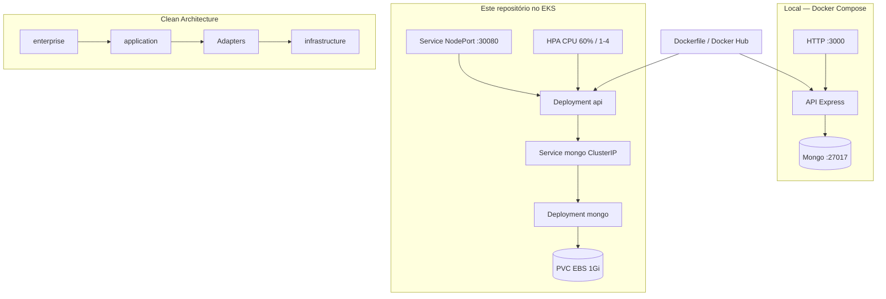

# TechChallenge-Fiap

API REST da **oficina mecânica Node-Fiap**: clientes, veículos, peças, serviços, estoque, ordens de serviço, orçamentos e execução.

Este repositório entrega **somente a aplicação**: código Node.js, `Dockerfile`, Compose local e manifests Kubernetes (`k8s/`). Cluster EKS, autenticação no API Gateway e MongoDB Atlas vivem em [repositórios irmãos](docs/REPOS.md).

## Propósito

- Expor o domínio da oficina em HTTP (`/api`), com contrato OpenAPI em `/docs`.
- Rodar igual no notebook (Compose) e no EKS (mesma imagem Docker).
- Isolar regras de negócio de Express, MongoDB e AWS (**Clean Architecture**).
- No cluster: API + Mongo in-cluster + HPA. Login de produção **não** entra neste repo.

Decisões deste repo (monolito, REST, HPA, OS): [RFCs](docs/rfcs/README.md) e [ADRs](docs/adrs/README.md). Nuvem, JWT e Mongo canônicos nos [repos irmãos](docs/REPOS.md).

## Tecnologias

| Camada | Tecnologia |
|---|---|
| Runtime | Node.js 20, TypeScript 5 |
| HTTP | Express 4 |
| Persistência | MongoDB 8 (`MONGODB_URI`) |
| Auth local | JWT HS256 (`AUTH_MODE=local`) |
| Auth no EKS | `AUTH_MODE=gateway` — JWT fica nas Lambdas do repo de auth |
| E-mail | Nodemailer (SMTP) |
| Contrato | OpenAPI / Swagger UI |
| Testes | Jest, SuperTest |
| Empacote | Docker (`node:20-alpine`) |
| Orquestração | Kubernetes (Deployment, Service NodePort `30080`, HPA, PVC) |
| CI/CD | GitHub Actions → Docker Hub `ruanngodinho/techchallenge:latest` |

## Arquitetura deste repositório

O que **este** repo constrói e sobe. A borda (API Gateway + Lambdas) e o Terraform do cluster estão fora.



No EKS o cliente de produção não fala com o NodePort: o [TechChallenge-lambda-auth](https://github.com/RuannGodinho/TechChallenge-lambda-auth) faz proxy autenticado. Visão completa: [diagrama de componentes](docs/ARQUITETURA-COMPONENTES.md).

## APIs — Swagger e Postman

Não há collection Postman versionada. A fonte do contrato é o **OpenAPI** gerado pela própria API.

| Ambiente | Swagger UI | OpenAPI JSON (importe no Postman) |
|---|---|---|
| Local (Compose) | [http://localhost:3000/docs](http://localhost:3000/docs) | [http://localhost:3000/swagger.json](http://localhost:3000/swagger.json) |
| EKS (NodePort) | `http://<IP_DO_NODE>:30080/docs` | `http://<IP_DO_NODE>:30080/swagger.json` |
| Produção (API Gateway) | `https://<api-id>.execute-api.us-east-1.amazonaws.com/docs` | `https://<api-id>.execute-api.us-east-1.amazonaws.com/swagger.json` |

**Postman:** Import → Link → cole a URL do `swagger.json`.

Login local: `POST /api/login` com `AUTH_EMAIL` / `AUTH_PASSWORD` do `.env`. Nas demais rotas: header `Authorization: Bearer <token>`.

Consulta pública (sem JWT): `GET /api/ordensServico/:cpfCnpj/detalhes`.

## Requisitos

- Docker e Docker Compose (execução local)
- Node.js 20.x e npm 10+ (testes / run sem Docker)
- Arquivo `.env` a partir de [`.env.example`](.env.example)
- Para deploy no cluster: `kubectl`, AWS CLI, cluster `techchallenge-eks` já criado no [TechChallenge-infra-eks](https://github.com/RuannGodinho/TechChallenge-infra-eks)

## Execução local

### Docker Compose (recomendado)

```bash
cp .env.example .env   # ajuste SMTP, JWT e AUTH_*
docker compose up -d --build
docker compose ps
```

- API: http://localhost:3000
- Swagger: http://localhost:3000/docs
- Mongo: `localhost:27017`, banco `Node-Fiap` (seed roda no start da API)

```bash
docker compose logs -f api
docker compose down
```

`AUTH_MODE=local` (default): o Express emite e valida o JWT.

### Sem Docker

```bash
cp .env.example .env
# suba um Mongo em mongodb://127.0.0.1:27017/Node-Fiap
npm ci
npm test
npm run dev
```

### Testes

```bash
npm test
npm run coverage
```

## Deploy

Pré-requisito: EKS no ar (repo de infra). Neste repo **não** há Terraform de VPC/cluster.

### GitHub Actions

| Workflow | Quando | O que faz |
|---|---|---|
| CI (`.github/workflows/ci.yml`) | PR e push | `npm ci`, typecheck, testes |
| CD (`.github/workflows/cd.yml`) | CI verde na `main`, ou `workflow_dispatch` | Build/push Docker Hub + `kubectl apply` de `k8s/` |

Nesta branch (`feat/split-four-repos`) o CD para o cluster é **manual** (`workflow_dispatch` com `confirm=yes`), para não sobrescrever a `main`.

Secrets: `AWS_ACCESS_KEY_ID`, `AWS_SECRET_ACCESS_KEY`, `DOCKERHUB_USERNAME`, `DOCKERHUB_PASSWORD`, `GATEWAY_TRUST_SECRET`. Detalhe: [docs/GITHUB-ACTIONS.md](docs/GITHUB-ACTIONS.md).

### Manual (`kubectl`)

```bash
aws eks update-kubeconfig --region us-east-1 --name techchallenge-eks
kubectl apply -f k8s/metrics-server.yml
kubectl apply -f k8s/secrets/
kubectl apply -f k8s/mongo/
kubectl apply -f k8s/Api-deployment.yml
kubectl apply -f k8s/Api-service.yml
kubectl apply -f k8s/API-hpa.yml
kubectl get job api-seed-job || kubectl apply -f k8s/api-seed-job.yml
```

Passo a passo e troubleshooting: [docs/KUBERNETES.md](docs/KUBERNETES.md).

Ordem ponta a ponta (quatro repos): infra EKS → Atlas opcional → **este repo** → Lambda/Gateway.

## Variáveis de ambiente

| Variável | Uso |
|---|---|
| `PORT` | HTTP (default `3000`) |
| `MONGODB_URI` | Conexão MongoDB |
| `NODE_ENV` | Ambiente |
| `AUTH_MODE` | `local` (Compose) ou `gateway` (EKS) |
| `JWT_SECRET` / `JWT_EXPIRES_IN` | JWT no modo local |
| `AUTH_EMAIL` / `AUTH_PASSWORD` | Usuário mock no modo local |
| `GATEWAY_TRUST_SECRET` | Confiança Gateway → pod (`AUTH_MODE=gateway`) |
| `SMTP_HOST` `SMTP_PORT` `SMTP_USER` `SMTP_PASS` | Envio de orçamento |
| `SMTP_FROM` / `SMTP_SECURE` | Remetente / TLS 465 |
| `ORCAMENTO_EMAIL_TO` | Destinatário do orçamento |

No Compose, `PORT`, `MONGODB_URI` e `NODE_ENV` vêm do `docker-compose.yml`; o restante do `.env`.

## Estrutura

```text
src/enterprise/          entidades e value objects
src/application/         casos de uso e ports
src/Adapters/            controllers, presenters, gateways Mongo
src/infrastructure/      Express, DI, middlewares
k8s/                     API, Mongo in-cluster, HPA, seed
mongo-init/              seed local e Job Kubernetes
docs/                    arquitetura, RFCs, ADRs
```

## Repositórios irmãos

| Repositório | Papel |
|---|---|
| [TechChallenge-infra-eks](https://github.com/RuannGodinho/TechChallenge-infra-eks) | VPC, EKS, SSM |
| [TechChallenge-lambda-auth](https://github.com/RuannGodinho/TechChallenge-lambda-auth) | JWT + API Gateway |
| [TechChallenge-infra-db](https://github.com/RuannGodinho/TechChallenge-infra-db) | Atlas M0 (opt-in) |

## Documentação

| Documento | Conteúdo |
|---|---|
| [Arquitetura](docs/ARQUITETURA.md) | Índice e checklist do enunciado |
| [Componentes](docs/ARQUITETURA-COMPONENTES.md) | Nuvem, APIs, banco, monitoramento |
| [Sequência — Auth](https://github.com/RuannGodinho/TechChallenge-lambda-auth/blob/main/docs/ARQUITETURA-SEQUENCIA-AUTENTICACAO.md) | Login JWT (repo lambda-auth) |
| [Sequência — OS](docs/ARQUITETURA-SEQUENCIA-ORDEM-SERVICO.md) | Abertura de OS |
| [Modelo de dados](docs/ARQUITETURA-MODELO-DADOS.md) | Justificativa do Mongo, ER e relacionamentos |
| [RFCs](docs/rfcs/README.md) / [ADRs](docs/adrs/README.md) | Decisões técnicas e permanentes |
| [Kubernetes](docs/KUBERNETES.md) | Manifests e acesso |
| [GitHub Actions](docs/GITHUB-ACTIONS.md) | CI/CD deste repo |
| [Quatro repositórios](docs/REPOS.md) | Split e ordem de deploy |
