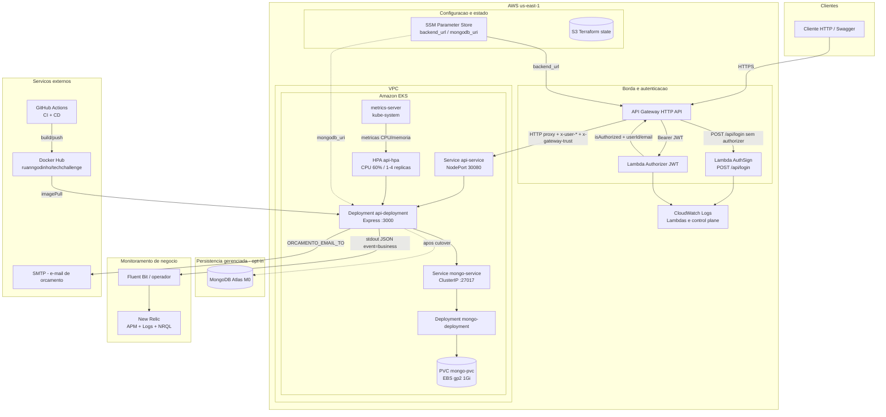
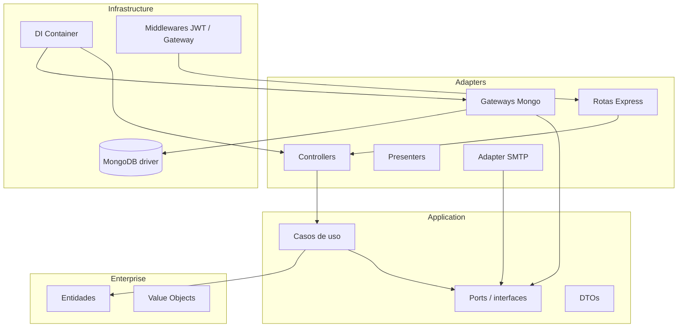

# Diagrama de Componentes

Visão de **nuvem**, **APIs**, **banco** e **monitoramento** da solução **Node-Fiap**.

O cliente HTTP acessa apenas o **API Gateway**. O cluster EKS não expõe login: com `AUTH_MODE=gateway`, `POST /api/login` no pod responde **410**.

Índice da arquitetura: [ARQUITETURA.md](ARQUITETURA.md). Modelo de dados: [ARQUITETURA-MODELO-DADOS.md](ARQUITETURA-MODELO-DADOS.md).

| Visão pedida | Onde está neste documento |
|---|---|
| Nuvem | Subgrafo `AWS us-east-1`: API Gateway, Lambdas, VPC/EKS, SSM, S3, CloudWatch |
| APIs | Lambda `AuthSign` (`POST /api/login`) + Express no EKS (`/api`, `/docs`) |
| Banco | Mongo no EKS via TechChallenge-infra-db (PVC EBS); Atlas M0 opt-in |
| Monitoramento | metrics-server + HPA, CloudWatch das Lambdas, Fluent Bit + New Relic |

---

## Diagrama

### Como ler o diagrama

1. **Nuvem / borda:** API Gateway é o único ponto de entrada público (região `us-east-1`).
2. **APIs:** login na Lambda `AuthSign`; demais rotas passam pelo authorizer JWT e seguem para o Express no EKS.
3. **Banco:** MongoDB no EKS (Deployment + PVC), aplicado pelo [TechChallenge-infra-db](https://github.com/RuannGodinho/TechChallenge-infra-db). Atlas M0 continua opt-in nesse mesmo repo.
4. **Monitoramento:** metrics-server alimenta o HPA; Lambdas gravam logs no CloudWatch; a API emite JSON `event = business` para o New Relic (Fluent Bit).

Em ambiente local (`sam local`), a integração HTTP do Gateway é simulada pela Lambda `BackendProxyFunction`, que encaminha para `http://localhost:3000`. Em produção, o Gateway usa a URL publicada no SSM (`/techchallenge/eks/backend_url`).

---

## Camadas de software (Clean Architecture)

A API aplica Clean Architecture em quatro camadas. Dependências apontam para dentro: domínio não conhece Express, MongoDB nem AWS.

| Camada | Pasta | Responsabilidade |
|---|---|---|
| Enterprise | `src/enterprise` | Entidades (`OrdemServico`, `Cliente`, `Veiculo`) e value objects (`StatusOS`, `Documento`) |
| Application | `src/application` | Casos de uso, DTOs e ports |
| Adapters | `src/Adapters` | Controllers, presenters e gateways Mongo |
| Infrastructure | `src/infrastructure` | Express, DI, middlewares e conexão com o banco |

---

## Catálogo de componentes

### Nuvem e entrega

| Componente | Tecnologia | Responsabilidade |
|---|---|---|
| API Gateway HTTP API | AWS | Entrada HTTPS, authorizer JWT e proxy HTTP para o EKS |
| Lambda AuthSign | Node.js 20 | Valida e-mail/senha (`AUTH_EMAIL` / `AUTH_PASSWORD`) e assina JWT (`HS256`, expiração `JWT_EXPIRES_IN`) |
| Lambda Authorizer | Node.js 20 | Valida `Authorization: Bearer`; devolve `userId` e `email` no contexto |
| EKS | Kubernetes | Orquestra API, HPA e metrics-server; o Mongo é apply do infra-db |
| Service `api-service` | NodePort 30080 | Expõe o container `:3000` no IP público do node |
| SSM Parameter Store | AWS | `backend_url` para o Gateway; URI do Atlas quando habilitado |
| S3 | AWS | Backend remoto do Terraform |
| Docker Hub | Registry | Imagem `ruanngodinho/techchallenge:latest` |
| GitHub Actions | CI/CD | CI (`npm ci`, build, test); CD (`kubectl apply` + rollout) |

### Aplicação e APIs

| Componente | Tecnologia | Responsabilidade |
|---|---|---|
| API Express | Node.js 20, TypeScript | Rotas REST em `/api`; Swagger em `/docs` |
| Auth no pod | `AUTH_MODE=gateway` | Confia em `x-gateway-trust` + `x-user-id` / `x-user-email`; login local desligado (HTTP 410) |
| SMTP | Nodemailer | Envio de orçamento pendente para `ORCAMENTO_EMAIL_TO` |

Rotas montadas em `app.ts` sob `/api`:

| Recurso | Endpoints principais | Auth |
|---|---|---|
| Login | `POST /api/login` | Público no Gateway |
| Sessão | `GET /api/me` | JWT |
| Clientes | `GET/POST /api/clientes`, `GET/PUT/DELETE /api/clientes/:id`, `GET /api/clientes/cpf/:cpf` | JWT |
| Veículos | CRUD `/api/veiculos` | JWT |
| Peças | CRUD `/api/pecas` | JWT |
| Serviços | CRUD `/api/servicos` | JWT |
| Estoque | `GET /api/estoque`, `POST /api/estoque/movimentacoes` | JWT |
| Ordens de serviço | `POST/GET /api/ordensServico`, `PUT /api/ordensServico/:id` | JWT |
| Consulta pública de OS | `GET /api/ordensServico/:cpfCnpj/detalhes` | Sem JWT |
| Orçamentos | `PUT /api/orcamentos/:id`, `GET /api/orcamentos/:ordemServicoId` | JWT |
| Execução | `GET /api/execucoes-servico/:ordemServicoId`, `PATCH .../iniciar`, `PATCH .../finalizar` | JWT |
| Métricas de negócio | `GET /api/metricas/tempo-medio-servicos` | JWT |
| Contrato | `GET /docs`, `GET /swagger.json` | Público no Gateway |

### Banco

| Componente | Onde | Função |
|---|---|---|
| MongoDB 8 no EKS | Repo `TechChallenge-infra-db` (`k8s/`) | Persistência da API (`MONGODB_URI` → `mongo-service:27017/Node-Fiap`) |
| `mongo-service` | ClusterIP `:27017` | DNS interno do cluster |
| MongoDB Atlas M0 | Repo `TechChallenge-infra-db` | Persistência gerenciada (opt-in) |
| Coleção `OrdemServico` | Banco `Node-Fiap` | Documento da OS (cliente, veículo, peças, serviços, status, `dataAbertura`, `statusEnteredAt`) |
| Coleções correlatas | Mesmo banco | `Cliente`, `Veiculo`, `Peca`, `Servico`, `ExecucaoServico`, estoque e orçamentos |

A OS é um agregado DDD: um documento com peças e serviços aninhados, sem JOINs na abertura. ER relacional, ajustes e cardinalidades: [ARQUITETURA-MODELO-DADOS.md](ARQUITETURA-MODELO-DADOS.md).

### Monitoramento

| Componente | Escopo | O que observa |
|---|---|---|
| **metrics-server** | `kube-system` | CPU e memória de pods/nodes (`metrics.k8s.io`) |
| **HPA `api-hpa`** | Deployment da API | Escala 1–4 réplicas quando a CPU média passa de 60% do request (`100m`) |
| **CloudWatch Logs** | Lambdas AuthSign e Authorizer | Invocações, 401 de login e falhas de JWT |
| **kubectl top / describe hpa** | Operação do cluster | Verificação manual de carga e autoscaling |
| **`GET /api/metricas/tempo-medio-servicos`** | Negócio | Tempo médio de execução de serviços (não é o tempo da OS em cada status) |
| **Logs de domínio (Pino)** | Use cases de OS / orçamento / execução | Eventos `event = business` com `requestId` e `trace.id` |
| **Fluent Bit** | Daemon/operador no cluster | Encaminha stdout dos pods para o New Relic |
| **New Relic Logs + APM** | SaaS | Dashboards e alertas NRQL — ver [NRQL.md](observabilidade/NRQL.md) |

Autoscaling continua no recorte da [ADR-012](adrs/012-hpa-observabilidade.md). A observabilidade de **negócio** (volume de OS, tempo por status, falhas de processamento) está na [ADR-016](adrs/016-observabilidade-negocio.md).

---

## Documentação relacionada

- [Arquitetura (índice)](ARQUITETURA.md)
- [Modelo de dados — ER e justificativa](ARQUITETURA-MODELO-DADOS.md)
- [Sequência — Autenticação](ARQUITETURA-SEQUENCIA-AUTENTICACAO.md)
- [Sequência — Abertura de ordem de serviço](ARQUITETURA-SEQUENCIA-ORDEM-SERVICO.md)
- [Kubernetes](KUBERNETES.md)
- [Quatro repositórios](REPOS.md)
