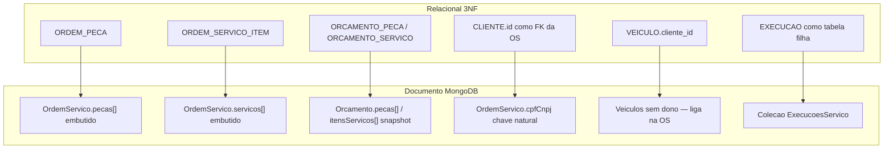

# Modelo de dados — justificativa, ER e relacionamentos

Justificativa formal da persistência da **Node-Fiap**, o modelo relacional de referência, os **ajustes** aplicados ao implementar no MongoDB e a explicação dos relacionamentos.

Decisão do engine: [RFC-002 / ADR-002 no infra-db](https://github.com/RuannGodinho/TechChallenge-infra-db/blob/main/docs/rfcs/002-mongodb-persistencia.md). Índice: [ARQUITETURA.md](ARQUITETURA.md).

---

## 1. Justificativa formal da escolha do banco

### 1.1 Critério de escolha

O núcleo do domínio é a **Ordem de Serviço**. Uma OS não é uma linha plana: ela carrega cliente (documento), veículo, lista variável de peças (quantidade + preço no momento do atendimento) e lista variável de serviços. Troca de óleo e retífica não compartilham o mesmo formato.

A persistência precisava atender, ao mesmo tempo:

| Critério | Por que importa neste recorte |
|---|---|
| Forma variável do agregado OS | Evitar explosion de tabelas-ponte e migrations a cada campo novo do MVP |
| Leitura na abertura e na consulta pública | `POST /api/ordensServico` e `GET /api/ordensServico/:cpfCnpj/detalhes` devem recuperar o atendimento em poucos round-trips |
| Custo de laboratório | Sem RDS Multi-AZ; persistência que sobreviva a restart do pod |
| Mesmo contrato em local e EKS | Um `MONGODB_URI`; Compose, in-cluster e Atlas M0 (opt-in) |
| Isolamento de domínio | Casos de uso falam com ports; o driver não vaza para `src/enterprise` |

### 1.2 Decisão

Adotamos **MongoDB 8**, banco `Node-Fiap`. A OS é um **agregado DDD**: um documento com arrays de peças e serviços. Catálogos (cliente, veículo, peça, serviço) e satélites com ciclo de vida próprio (orçamento, execução, estoque) ficam em coleções separadas, ligadas por referência.

Dois estágios de operação — o mesmo modelo lógico:

| Estágio | Onde | Quando |
|---|---|---|
| Laboratório (padrão) | `mongo-deployment` + PVC EBS `gp2` 1 Gi | EKS sem flag de DB gerenciado |
| Gerenciado (opt-in) | MongoDB Atlas M0 — repo `TechChallenge-infra-db` | `enable_managed_db=true` |

### 1.3 Por que não relacional neste MVP

O modelo **relacional abaixo é válido** e foi o ponto de partida do desenho. Ele não foi descartado por “Mongo ser NoSQL”: foi descartado como *engine* porque o ganho de 3NF (JOIN, FK no banco, migrations) não paga o custo neste recorte.

| Alternativa | Avaliação | Motivo do descarte neste MVP |
|---|---|---|
| PostgreSQL (RDS ou no cluster) | Melhor integridade referencial e relatórios | Schema rígido da OS + custo de RDS / operação de outro engine no EKS |
| MySQL / MariaDB | Mesmo trade-off do PostgreSQL | Não modela a variabilidade da OS melhor que o documento |
| Amazon DynamoDB | Nativo AWS, escala | CRUD rico, listagens e métricas exigiriam GSIs cedo demais |
| Atlas desde o dia 1 | Evitaria Mongo no cluster | Bloqueia o CD (`kubectl apply`) até allowlist/rede de outro repo |
| Arquivo / SQLite | Zero custo | Incompatível com HPA (1–4 réplicas) |

Revisitaremos SQL se surgir módulo fiscal/contábil com restrições referenciais que o caso de uso não consiga garantir.

---

## 2. Modelo relacional de referência (ER lógico)

Antes do ajuste para documento, o domínio normaliza em 3NF. Este ER é o **contrato conceitual**: cardinalidades e chaves que o negócio exige, independente do engine.

```mermaid
erDiagram
    CLIENTE ||--o{ ORDEM_SERVICO : "abre (1:N via CPF/CNPJ)"
    VEICULO ||--o{ ORDEM_SERVICO : "e objeto de (1:N)"
    ORDEM_SERVICO ||--o{ ORDEM_PECA : "consome (1:N)"
    PECA ||--o{ ORDEM_PECA : "aparece em (1:N)"
    ORDEM_SERVICO ||--o{ ORDEM_SERVICO_ITEM : "contrata (1:N)"
    SERVICO ||--o{ ORDEM_SERVICO_ITEM : "aparece em (1:N)"
    PECA ||--|| ESTOQUE : "tem saldo (1:1)"
    PECA ||--o{ MOVIMENTACAO_ESTOQUE : "registra (1:N)"
    ORDEM_SERVICO ||--o{ ORCAMENTO : "gera (1:N versoes)"
    ORCAMENTO ||--o{ ORCAMENTO_PECA : "congela (1:N)"
    ORCAMENTO ||--o{ ORCAMENTO_SERVICO : "congela (1:N)"
    ORDEM_SERVICO ||--o{ EXECUCAO_SERVICO : "acompanha (1:N)"
    SERVICO ||--o{ EXECUCAO_SERVICO : "e executado em (1:N)"

    CLIENTE {
        string id PK
        string nome
        string email
        string cpf_cnpj UK
        string telefone
    }

    VEICULO {
        string id PK
        string placa UK
        string modelo
        int ano
        string marca
    }

    PECA {
        string id PK
        string nome
        string descricao
        string tipo
        decimal preco
    }

    SERVICO {
        string id PK
        string nome
        string descricao
        decimal preco
    }

    ESTOQUE {
        string peca_id PK_FK
        int quantidade
    }

    MOVIMENTACAO_ESTOQUE {
        string id PK
        string peca_id FK
        string tipo
        int quantidade
        datetime data
        string origem
    }

    ORDEM_SERVICO {
        string id PK
        string cpf_cnpj FK
        string veiculo_id FK
        string status
        datetime data_abertura
        datetime status_entered_at
        decimal valor_total
    }

    ORDEM_PECA {
        string ordem_id PK_FK
        string peca_id PK_FK
        int quantidade
        decimal valor_unitario
    }

    ORDEM_SERVICO_ITEM {
        string ordem_id PK_FK
        string servico_id PK_FK
    }

    ORCAMENTO {
        string id PK
        string ordem_servico_id FK
        int versao
        string status
        decimal valor_total
        datetime validade_em
        datetime criado_em
    }

    ORCAMENTO_PECA {
        string orcamento_id PK_FK
        string peca_id
        string nome
        decimal preco
        int quantidade
    }

    ORCAMENTO_SERVICO {
        string orcamento_id PK_FK
        string servico_id
        string nome
        decimal preco
    }

    EXECUCAO_SERVICO {
        string id PK
        string ordem_servico_id FK
        string servico_id FK
        string status
        datetime criado_em
        datetime iniciado_em
        datetime finalizado_em
    }
```

### Cardinalidades (modelo relacional)

| Relacionamento | Cardinalidade | Tipo | Significado |
|---|---|---|---|
| Cliente → Ordem de Serviço | 1 : N | identificador natural | Um cliente abre várias OS; cada OS aponta para **um** CPF/CNPJ |
| Veículo → Ordem de Serviço | 1 : N | associativo | Um veículo entra em várias OS ao longo do tempo; cada OS trata **um** veículo |
| Cliente → Veículo | — | **não modelado** | Não há `cliente_id` em Veículo. A posse aparece na OS (quem abriu × qual placa) |
| OS → Peça (via `ORDEM_PECA`) | N : N | associativo com atributos | Quantidade e `valor_unitario` pertencem ao **atendimento**, não ao catálogo |
| OS → Serviço (via `ORDEM_SERVICO_ITEM`) | N : N | associativo | IDs de serviço contratados naquela OS (deduplicados no domínio) |
| Peça → Estoque | 1 : 1 | dependente | Um saldo corrente por peça |
| Peça → Movimentação | 1 : N | histórico | Entradas/saídas não alteram o catálogo |
| OS → Orçamento | 1 : N | histórico versionado | Várias versões; itens do orçamento são **snapshot** |
| OS → Execução de Serviço | 1 : N | ciclo de vida próprio | Iniciar/finalizar não cabe como flag na OS |

---

## 3. Ajustes no modelo relacional

O ER da seção 2 permanece o mapa mental. Na implementação, seis ajustes evitam JOIN na abertura da OS e separam o que tem ciclo de vida próprio.



| # | No relacional | Ajuste implementado | Por quê |
|---|---|---|---|
| 1 | Tabelas-ponte `ORDEM_PECA` e `ORDEM_SERVICO_ITEM` | Arrays **embutidos** no documento `OrdemServico` | Abertura e consulta pública leem o agregado em um `find`/`insertOne`. Quantidade e preço unitário viajam com a OS |
| 2 | `ORDEM_SERVICO.cliente_id` → `CLIENTE.id` | Referência por **chave natural** `cpfCnpj` (campo `cpf` em `Clientes`) | A consulta pública é `GET /api/ordensServico/:cpfCnpj/detalhes`. O atendimento identifica o dono pelo documento fiscal, não pelo ObjectId |
| 3 | `VEICULO.cliente_id` (1:N clássico oficina→frota) | **Removido.** `Veiculos` é catálogo por placa | O código não persiste dono no veículo. A associação cliente–placa ocorre na OS. Evita FK órfã quando a mesma placa reaparece em outro atendimento |
| 4 | Tabelas `ORCAMENTO_PECA` / `ORCAMENTO_SERVICO` | Arrays **snapshot** no documento `Orcamento` | Orçamento aprovado/rejeitado não pode mudar se o catálogo de peças alterar o preço depois |
| 5 | `EXECUCAO_SERVICO` só como filho com ON DELETE | Coleção **separada** `ExecucoesServico` | `iniciar` / `finalizar` têm status e timestamps próprios; embedding na OS misturaria agregado de abertura com operação de oficina |
| 6 | FK e `CHECK` no engine | Integridade no **caso de uso** | Mongo não impõe FK. `CriarOrdemServicoUseCase` exige cliente e veículo existentes antes do `insertOne`. Transição de status vive em `StatusOS.validateTransition` |

O que **não** foi desnormalizado de propósito:

- Cliente e veículo **não** são copiados para dentro da OS (só `cpfCnpj` + `veiculo` ObjectId). Evita drift de nome/telefone a cada update do cadastro.
- Estoque e movimentações permanecem coleções próprias: saldo é compartilhado entre OS, não pertence a uma OS.

---

## 4. Modelo implementado (coleções)

Banco: `Node-Fiap`. Nomes iguais aos gateways em `src/Adapters/gateways`.

```mermaid
erDiagram
    Clientes ||--o{ OrdemServico : "cpf = cpfCnpj"
    Veiculos ||--o{ OrdemServico : "_id = veiculo"
    Pecas ||--o{ OrdemServico : "pecas.pecaId"
    Servicos ||--o{ OrdemServico : "servicos[]"
    Pecas ||--|| Estoque : "pecaId"
    Pecas ||--o{ MovimentacoesEstoque : "pecaId"
    OrdemServico ||--o{ Orcamento : "_id = ordemServicoId"
    OrdemServico ||--o{ ExecucoesServico : "_id = ordemServicoId"
    Servicos ||--o{ ExecucoesServico : "_id = servicoId"

    Clientes {
        ObjectId _id PK
        string nome
        string email
        string cpf UK
        string telefone
    }

    Veiculos {
        ObjectId _id PK
        string placa UK
        string modelo
        int ano
        string marca
    }

    Pecas {
        ObjectId _id PK
        string nome
        string descricao
        string tipo
        number preco
    }

    Servicos {
        ObjectId _id PK
        string nome
        string descricao
        number preco
    }

    Estoque {
        ObjectId pecaId PK_FK
        number quantidade
    }

    MovimentacoesEstoque {
        ObjectId _id PK
        string pecaId FK
        string tipo
        number quantidade
        date data
        string origem
    }

    OrdemServico {
        ObjectId _id PK
        string cpfCnpj FK
        ObjectId veiculo FK
        string status
        date dataAbertura
        date statusEnteredAt
        array pecas
        array servicos
        number valorTotal
    }

    Orcamento {
        ObjectId _id PK
        ObjectId ordemServicoId FK
        number versao
        string status
        array pecas
        array itensServicos
        number valorTotal
        date validadeEm
        date criadoEm
    }

    ExecucoesServico {
        ObjectId _id PK
        ObjectId ordemServicoId FK
        ObjectId servicoId FK
        string status
        date criadoEm
        date iniciadoEm
        date finalizadoEm
    }
```

Documento da OS (agregado):

```text
OrdemServico {
  _id,
  cpfCnpj,                    // chave natural → Clientes.cpf
  veiculo,                    // ObjectId → Veiculos._id
  status,                     // RECEBIDA … ENTREGUE
  dataAbertura,
  statusEnteredAt,            // início do status atual (observabilidade)
  pecas: [ { pecaId, quantidade, valorUnitario } ],
  servicos: [ ObjectId ],     // → Servicos._id
  valorTotal
}
```

---

## 5. Explicação dos relacionamentos

### 5.1 Cliente × Ordem de Serviço (1:N, chave natural)

Um cliente (`Clientes.cpf`) pode ter várias OS. A OS **não** guarda `clienteId`. Guarda `cpfCnpj`.

- **Criação:** `CriarOrdemServicoUseCase` chama `existsByCpf` antes de persistir.
- **Consulta pública:** `find({ cpfCnpj })` — sem JOIN e sem JWT ([ADR-015](adrs/015-consulta-publica-os.md)).
- **Risco aceito:** se o cadastro trocar o CPF, OS antigas continuam no documento anterior. Troca de documento fiscal é evento raro; o trade-off favorece a busca pública.

### 5.2 Veículo × Ordem de Serviço (1:N, ObjectId)

`OrdemServico.veiculo` referencia `Veiculos._id`. O use case valida `existsById`.

Não há relação Cliente–Veículo persistida. Na oficina real um carro “pertence” a alguém; neste MVP a posse é **do atendimento**: a OS diz quem abriu e qual placa estava no pátio. Isso é o ajuste #3 da seção 3.

### 5.3 OS × Peças (N:N embutido, com atributos)

`pecas[]` substitui a tabela-ponte. Cada item carrega:

| Campo | Origem | Papel |
|---|---|---|
| `pecaId` | `Pecas._id` | Referência ao catálogo (preço de lista pode mudar) |
| `quantidade` | atendimento | Quantidade desta OS |
| `valorUnitario` | atendimento | Preço praticado no momento (não o `Pecas.preco` futuro) |

É relacionamento N:N **com atributos**. Embedding evita `ORDEM_PECA` e mantém o preço histórico no agregado.

### 5.4 OS × Serviços (N:N embutido, só IDs)

`servicos[]` é a lista deduplicada de `Servicos._id`. Não há quantidade/preço no array da OS: o valor entra em `valorTotal` e, se houver orçamento, no snapshot do `Orcamento`.

Ao criar a OS com serviços, o domínio gera documentos em `ExecucoesServico` (status `PENDENTE`). A lista na OS responde “o que foi contratado”; a coleção de execução responde “em que etapa está cada serviço”.

### 5.5 Peça × Estoque (1:1) e Peça × Movimentação (1:N)

`Estoque.pecaId` é a chave de negócio do saldo. `MovimentacoesEstoque` é o histórico (`tipo` entrada/saída, `origem`).

O saldo **não** mora dentro da OS: várias OS podem consumir a mesma peça. A regra de saída insuficiente (`Não há estoque para a peça especificada`) fica na entidade `Estoque`, não no engine.

### 5.6 OS × Orçamento (1:N versionado)

`Orcamento.ordemServicoId` → `OrdemServico._id`. Itens `pecas` e `itensServicos` são **cópias** (nome, descrição, preço), não só IDs.

Ajuste deliberado em relação ao 3NF: o orçamento é um documento comercial. Recalcular a partir do catálogo atual falsificaria o valor enviado por SMTP ([ADR-014](adrs/014-smtp-orcamento.md)).

### 5.7 OS × Execução de Serviço (1:N)

`ExecucoesServico` referencia OS e Serviço. Status próprio (`PENDENTE` → `EM_EXECUCAO` → `FINALIZADO`) com `iniciadoEm` / `finalizadoEm`.

Permanece coleção separada porque o ciclo de vida diverge do status da OS (`RECEBIDA` → … → `ENTREGUE`). A métrica `GET /api/metricas/tempo-medio-servicos` lê execuções, não o array `servicos` da OS.

### 5.8 Diagrama de dependência do atendimento

```mermaid
flowchart LR
    C[Clientes] -->|cpfCnpj| OS[OrdemServico]
    V[Veiculos] -->|veiculo| OS
    P[Pecas] -->|pecas.pecaId| OS
    S[Servicos] -->|servicos[]| OS
    OS --> O[Orcamento snapshot]
    OS --> E[ExecucoesServico]
    S --> E
    P --> Est[Estoque]
    P --> Mov[MovimentacoesEstoque]
```

---

## 6. Integridade sem FK de engine

| Regra | Onde é garantida |
|---|---|
| CPF/CNPJ e e-mail válidos | Value objects `Documento`, `Email` |
| Placa válida | Value object `Placa` |
| Cliente existe na abertura da OS | `CriarOrdemServicoUseCase` + `ClienteLookup` |
| Veículo existe na abertura da OS | `CriarOrdemServicoUseCase` + `VeiculoLookup` |
| Status da OS só avança no fluxo legal | `StatusOS.validateTransition` |
| Serviços duplicados na OS | `OrdemServico.dedupeServicos` |
| Estoque não fica negativo | `Estoque.registrarMovimentacao` |
| Execução não inicia se já finalizada | `ExecucaoServico.iniciar` / `finalizar` |

Índices úteis (laboratório e Atlas): `Clientes.cpf` (único), `Veiculos.placa` (único), `OrdemServico.cpfCnpj`, `OrdemServico.status`, `ExecucoesServico.ordemServicoId`, `Estoque.pecaId` (único).

---

## 7. Ciclo de vida que o modelo precisa sustentar

```text
OS:     RECEBIDA → EM DIAGNOSTICO → AGUARDANDO APROVACAO → EM EXECUCAO → FINALIZADA → ENTREGUE
Exec:   PENDENTE → EM_EXECUCAO → FINALIZADO
Orc:    PENDENTE → APROVADO | REJEITADO
```

`statusEnteredAt` na OS não é atributo de negócio da oficina: existe para calcular `durationMs` na transição e alimentar a observabilidade ([ADR-016](adrs/016-observabilidade-negocio.md)). No relacional seria coluna extra; no documento é campo opcional com fallback em `dataAbertura`.

---

## Documentação relacionada

- [RFC-002 — MongoDB (infra-db)](https://github.com/RuannGodinho/TechChallenge-infra-db/blob/main/docs/rfcs/002-mongodb-persistencia.md)
- [ADR-002 — Persistimos no MongoDB (infra-db)](https://github.com/RuannGodinho/TechChallenge-infra-db/blob/main/docs/adrs/002-mongodb-persistencia.md)
- [Diagrama de Componentes](ARQUITETURA-COMPONENTES.md)
- [Sequência — Abertura de OS](ARQUITETURA-SEQUENCIA-ORDEM-SERVICO.md)
- [Arquitetura (índice)](ARQUITETURA.md)
