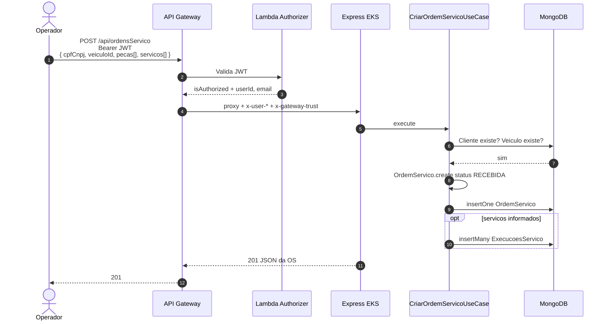
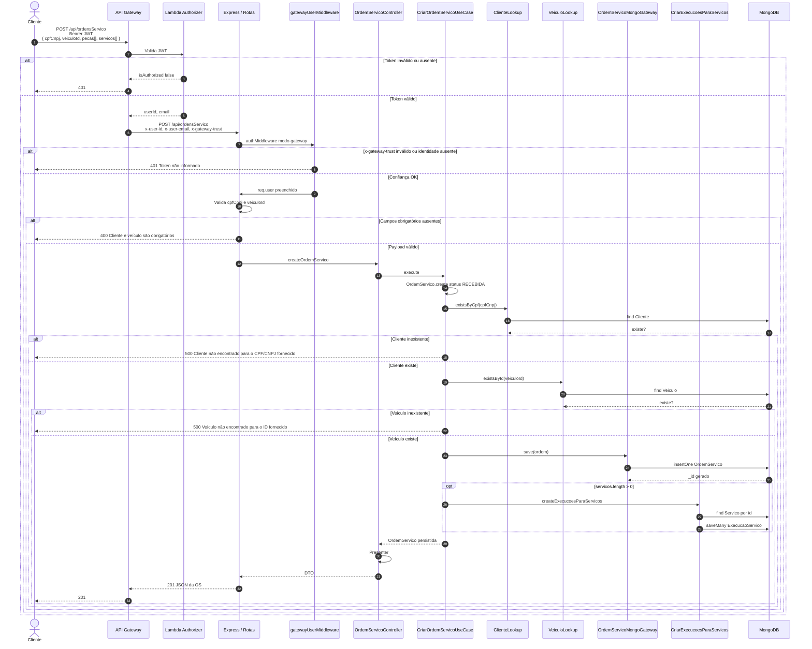

# Diagrama de Sequência — Abertura de ordem de serviço

Fluxo autenticado de `POST /api/ordensServico` na solução **Node-Fiap**.

Pré-condição: o operador já possui JWT ([sequência de autenticação](ARQUITETURA-SEQUENCIA-AUTENTICACAO.md)). Cliente e veículo devem existir no MongoDB ([modelo de dados](ARQUITETURA-MODELO-DADOS.md)).

Índice da arquitetura: [ARQUITETURA.md](ARQUITETURA.md). Componentes: [ARQUITETURA-COMPONENTES.md](ARQUITETURA-COMPONENTES.md).

| O que o enunciado pede | Neste documento |
|---|---|
| Sequência da abertura de OS | Diagrama 1 (caminho feliz) e diagrama 2 (validações e persistência) |

---

## Diagrama 1 — caminho feliz

Visão ponta a ponta, sem os ramos de erro. O operador já autenticou ([sequência de autenticação](ARQUITETURA-SEQUENCIA-AUTENTICACAO.md)).



A OS nasce como agregado: um documento com `cpfCnpj`, `veiculo`, `pecas[]` e `servicos[]` — sem JOIN. Detalhe do modelo: [ARQUITETURA-MODELO-DADOS.md](ARQUITETURA-MODELO-DADOS.md).

---

## Diagrama 2 — validações e persistência



---

## Regras de abertura

| Regra | Comportamento |
|---|---|
| Autenticação | JWT obrigatório (rota com `authMiddleware`) |
| Entrada mínima | `cpfCnpj` e `veiculoId` (alias `veiculo`) |
| Status inicial | `RECEBIDA` (`StatusOS.recebida()`) |
| `dataAbertura` | `new Date()` no momento da criação |
| Cliente | Deve existir no banco para o CPF/CNPJ |
| Veículo | Deve existir para o `veiculoId` |
| Peças | Opcional; cada item vira `OrdemPecaItem` |
| Serviços | Opcional; IDs deduplicados; cada um gera `ExecucaoServico` |
| Persistência | `insertOne` na coleção `OrdemServico` |
| Resposta | `201` com id, status, peças, serviços e `valorTotal` |

Ciclo de vida da OS após a abertura:

```text
RECEBIDA → EM DIAGNOSTICO → AGUARDANDO APROVACAO → EM EXECUCAO → FINALIZADA → ENTREGUE
```

A consulta `GET /api/ordensServico/:cpfCnpj/detalhes` é pública no Gateway (authorizer `NONE`), para o cliente da oficina acompanhar a OS sem JWT de operador.

---

## Documentação relacionada

- [Arquitetura (índice)](ARQUITETURA.md)
- [Diagrama de Componentes](ARQUITETURA-COMPONENTES.md)
- [Modelo de dados — ER e justificativa](ARQUITETURA-MODELO-DADOS.md)
- [Sequência — Autenticação](ARQUITETURA-SEQUENCIA-AUTENTICACAO.md)
