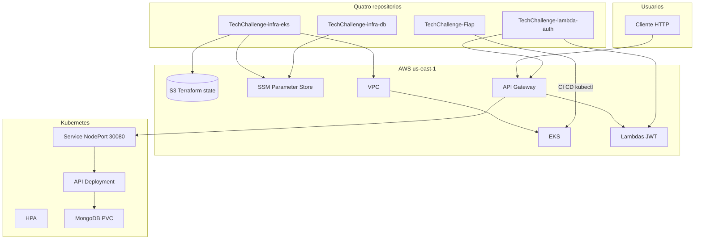

# Arquitetura da Solução

Visão de alto nível da fase Tech Challenge: o que foi construído, por quê, e como as peças se conectam.

## Descrição da solução

O **Node-Fiap** é uma API REST para gestão de oficinas mecânicas, permitindo controlar clientes, veículos, ordens de serviço, estoque e orçamentos.

Nesta fase, a aplicação deixa de rodar apenas em Docker Compose local e passa a ser entregue em um cluster **Amazon EKS**. A entrega está organizada em **quatro repositórios** (esta branch). Detalhes em [REPOS.md](REPOS.md).

A escolha por **NodePort** (`30080`) em vez de Ingress/ALB reduz custo em ambiente de laboratório, mantendo a API acessível pelo IP público do node.

## Objetivos desta fase

| Objetivo | Implementação | Benefício |
|---|---|---|
| Containerização | `Dockerfile` + imagem `ruanngodinho/techchallenge:latest` | Mesmo artefato em local e produção |
| Orquestração | Manifests em `k8s/` no EKS | Deploy reproduzível, restart automático |
| Infra como código | Repo `TechChallenge-infra-eks` (Terraform) | VPC, cluster e IAM versionados |
| Auth serverless | Repo `TechChallenge-lambda-auth` | JWT no API Gateway, API em modo `gateway` |
| Banco gerenciado | Repo `TechChallenge-infra-db` (Atlas M0, opt-in) | Caminho de menor custo; Mongo in-cluster até o cutover |
| CI/CD | `ci.yml` + `cd.yml` neste repo | Testes automáticos; deploy só após CI verde |
| Escalabilidade | HPA CPU 60%, 1–4 réplicas | Resposta a carga sem intervenção manual |
| Persistência | MongoDB + PVC EBS (`gp2`) até migrar para Atlas | Dados sobrevivem restart do pod |
| Observabilidade básica | metrics-server | Métricas de CPU para o HPA |

## Diagrama da arquitetura



## Componentes da aplicação

### Camada de software

| Componente | Tecnologia | Responsabilidade |
|---|---|---|
| **API** | Node.js 20, TypeScript, Express | Rotas REST em `/api`, Swagger em `/docs` |
| **Persistência** | MongoDB 8 | Clientes, veículos, OS, estoque, orçamentos |
| **Auth** | JWT via Lambda + API Gateway | Login e authorizer fora do pod |
| **Testes** | Jest | Validação em CI antes de qualquer deploy |
| **Documentação** | Swagger UI | Contrato da API para consumo |

### Camada de entrega

| Componente | Onde | Função |
|---|---|---|
| **Imagem Docker** | Docker Hub | Artefato versionado implantado no cluster |
| **CI** | GitHub Actions (este repo) | `npm ci`, `npm run build`, `npm test` |
| **CD** | GitHub Actions (este repo) | Build/push da imagem + `kubectl apply` |
| **Seed** | Job `api-seed-job` | Dados iniciais no Mongo (uma vez no cluster) |

## Fluxo de deploy (ponta a ponta)

```text
1. SETUP (uma vez)     TechChallenge-infra-eks bootstrap → bucket S3
2. INFRA (manual)      TechChallenge-infra-eks apply → EKS + SSM
3. DB (opt-in)         TechChallenge-infra-db apply → Atlas M0
4. APP (push main)     CI → CD → API :30080 (+ Mongo in-cluster)
5. AUTH (manual)       TechChallenge-lambda-auth apply → API Gateway
```

## Execução local (resumo)

```bash
docker compose up -d --build   # API :3000 + MongoDB
npm test                       # testes unitários
```

## Documentação relacionada

- [Quatro repositórios](REPOS.md)
- [Kubernetes](KUBERNETES.md)
- [Terraform](TERRAFORM.md) — aponta para o repo EKS
- [GitHub Actions](GITHUB-ACTIONS.md)
- [README da API](../README.md)
