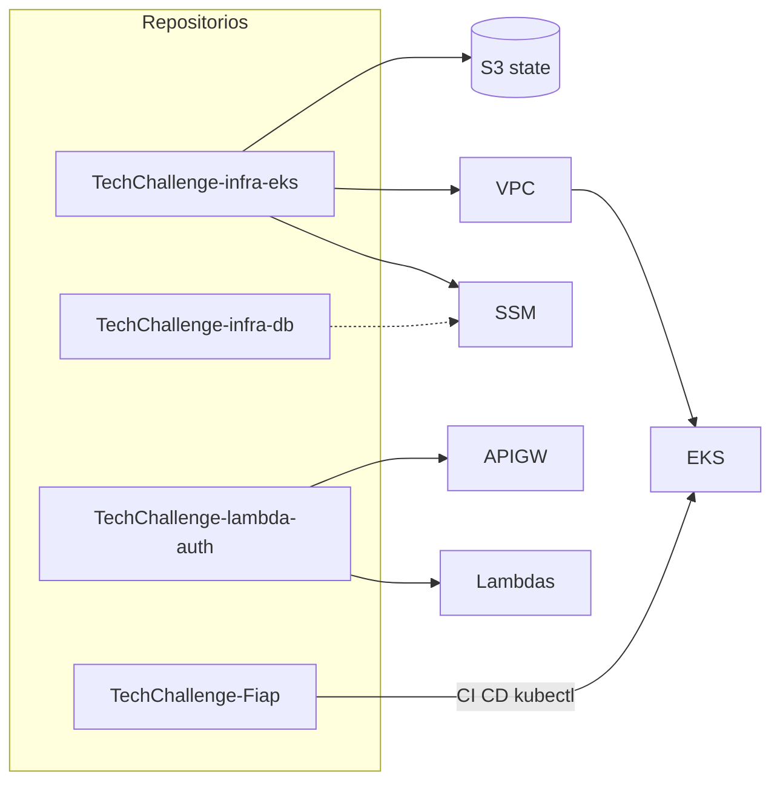

# Documentação da Arquitetura

Documentação arquitetural da solução **Node-Fiap**: API REST para gestão de oficinas mecânicas (clientes, veículos, ordens de serviço, estoque e orçamentos).

Esta fase entrega a aplicação em um cluster **Amazon EKS**, com autenticação JWT serverless no **API Gateway** e persistência em **MongoDB**. A entrega (código **e** docs) está em [quatro repositórios](REPOS.md): este repo guarda a API; EKS, JWT e Atlas têm `docs/` no GitHub correspondente.

---

## Checklist do enunciado

Cada tópico pedido na documentação da arquitetura e o artefato que o supre.

| # | Tópico do enunciado | Status | O que supre |
|---|---|---|---|
| 1 | Diagrama de Componentes (nuvem, APIs, banco e monitoramento) | Atendido | [ARQUITETURA-COMPONENTES.md](ARQUITETURA-COMPONENTES.md) — um flowchart com AWS (API Gateway, Lambdas, EKS, SSM, S3, CloudWatch), APIs Express, Mongo in-cluster/Atlas e monitoramento (metrics-server, HPA, CloudWatch, New Relic). Catálogo na mesma página. |
| 2 | Diagrama de Sequência — autenticação | Atendido | [TechChallenge-lambda-auth](https://github.com/RuannGodinho/TechChallenge-lambda-auth/blob/main/docs/ARQUITETURA-SEQUENCIA-AUTENTICACAO.md) (canônico). Ponteiro local: [ARQUITETURA-SEQUENCIA-AUTENTICACAO.md](ARQUITETURA-SEQUENCIA-AUTENTICACAO.md). |
| 3 | Diagrama de Sequência — abertura de ordens de serviço | Atendido | [ARQUITETURA-SEQUENCIA-ORDEM-SERVICO.md](ARQUITETURA-SEQUENCIA-ORDEM-SERVICO.md) — `POST /api/ordensServico` do Gateway ao `insertOne`, com regras de cliente/veículo e criação de execuções. |
| 4 | RFCs para decisões técnicas relevantes | Atendido | Índice em [docs/rfcs/](rfcs/README.md). Exemplos: nuvem ([RFC-001 no infra-eks](https://github.com/RuannGodinho/TechChallenge-infra-eks/blob/main/docs/rfcs/001-adocao-aws.md)), banco ([RFC-002 no infra-db](https://github.com/RuannGodinho/TechChallenge-infra-db/blob/main/docs/rfcs/002-mongodb-persistencia.md)), autenticação ([RFC-003 no lambda-auth](https://github.com/RuannGodinho/TechChallenge-lambda-auth/blob/main/docs/rfcs/003-autenticacao-jwt-api-gateway.md)). |
| 5 | ADRs para decisões arquiteturais permanentes | Atendido | [docs/adrs/](adrs/README.md) — 16 ADRs Aceitas, uma por RFC. Exemplos do enunciado: padrão de comunicação REST ([ADR-013](adrs/013-contrato-rest-swagger.md)), HPA ([ADR-012](adrs/012-hpa-observabilidade.md)). |
| 6 | Justificativa formal do banco + ajustes no modelo relacional + ER + relacionamentos | Atendido | ER e relacionamentos: [ARQUITETURA-MODELO-DADOS.md](ARQUITETURA-MODELO-DADOS.md) (este repo). Escolha do engine: [ADR-002 no infra-db](https://github.com/RuannGodinho/TechChallenge-infra-db/blob/main/docs/adrs/002-mongodb-persistencia.md). |

### RFCs e ADRs que o enunciado cita como exemplo

| Exemplo do enunciado | RFC (discussão) | ADR (decisão permanente) |
|---|---|---|
| Escolha da nuvem | [RFC-001 (infra-eks)](https://github.com/RuannGodinho/TechChallenge-infra-eks/blob/main/docs/rfcs/001-adocao-aws.md) | [ADR-001 (infra-eks)](https://github.com/RuannGodinho/TechChallenge-infra-eks/blob/main/docs/adrs/001-adocao-aws.md) |
| Escolha do banco | [RFC-002 (infra-db)](https://github.com/RuannGodinho/TechChallenge-infra-db/blob/main/docs/rfcs/002-mongodb-persistencia.md) | [ADR-002 (infra-db)](https://github.com/RuannGodinho/TechChallenge-infra-db/blob/main/docs/adrs/002-mongodb-persistencia.md) + [modelo de dados](ARQUITETURA-MODELO-DADOS.md) |
| Estratégia de autenticação | [RFC-003 (lambda-auth)](https://github.com/RuannGodinho/TechChallenge-lambda-auth/blob/main/docs/rfcs/003-autenticacao-jwt-api-gateway.md) | [ADR-003 (lambda-auth)](https://github.com/RuannGodinho/TechChallenge-lambda-auth/blob/main/docs/adrs/003-autenticacao-jwt-api-gateway.md) |
| Padrão de comunicação | [RFC-013](rfcs/013-contrato-rest-swagger.md) | [ADR-013](adrs/013-contrato-rest-swagger.md) — REST + OpenAPI |
| Uso de HPA | [RFC-012](rfcs/012-hpa-observabilidade.md) | [ADR-012](adrs/012-hpa-observabilidade.md) |

---

## Entregáveis desta documentação

| Documento | Conteúdo |
|---|---|
| [RFCs](rfcs/README.md) | Propostas técnicas (discussão, alternativas, pontos em aberto) |
| [ADRs](adrs/README.md) | Log de decisões aceitas (contexto, decisão, consequências) |
| [Diagrama de Componentes](ARQUITETURA-COMPONENTES.md) | Visão de nuvem, APIs, banco e monitoramento; camadas Clean Architecture; catálogo de componentes |
| [Sequência — Autenticação](https://github.com/RuannGodinho/TechChallenge-lambda-auth/blob/main/docs/ARQUITETURA-SEQUENCIA-AUTENTICACAO.md) | Login JWT (repo lambda-auth) |
| [Sequência — Abertura de OS](ARQUITETURA-SEQUENCIA-ORDEM-SERVICO.md) | `POST /api/ordensServico`: authorizer, regras de negócio e persistência no MongoDB |
| [Modelo de dados](ARQUITETURA-MODELO-DADOS.md) | Justificativa do MongoDB, ER relacional, ajustes para documento e relacionamentos |

---

## Visão da solução

A aplicação segue **Clean Architecture**: regras de negócio isoladas de HTTP, banco e nuvem. Em produção, o cliente HTTP não fala com o pod da API. O tráfego entra pelo **Amazon API Gateway**, que autentica o JWT e encaminha as chamadas para o **EKS**.

A escolha por **NodePort** (`30080`) em vez de Ingress/ALB reduz custo em laboratório, mantendo a API acessível pelo IP público do node.

### Objetivos desta fase

| Objetivo | Implementação | Benefício |
|---|---|---|
| Containerização | `Dockerfile` + imagem `ruanngodinho/techchallenge:latest` | Mesmo artefato em local e produção |
| Orquestração | Manifests em `k8s/` no EKS | Deploy reproduzível, restart automático |
| Infra como código | Repo `TechChallenge-infra-eks` (Terraform) | VPC, cluster e IAM versionados |
| Auth serverless | Repo `TechChallenge-lambda-auth` | JWT no API Gateway; API em `AUTH_MODE=gateway` |
| Banco gerenciado | Repo `TechChallenge-infra-db` (Atlas M0, opt-in) | Caminho de menor custo; Mongo in-cluster até o cutover |
| CI/CD | `ci.yml` + `cd.yml` neste repo | Testes automáticos; deploy só após CI verde |
| Escalabilidade | HPA CPU 60%, 1–4 réplicas | Resposta a carga sem intervenção manual |
| Persistência | MongoDB + PVC EBS (`gp2`) até migrar para Atlas | Dados sobrevivem restart do pod |
| Observabilidade básica | metrics-server + HPA + CloudWatch Logs das Lambdas | CPU para autoscaling e auditoria de auth |
| Observabilidade de negócio | Logs JSON (`event = business`) + New Relic NRQL | Volume de OS, tempo por status e alertas de falha |

---

## Fluxo de deploy (ponta a ponta)

```text
1. SETUP (uma vez)     TechChallenge-infra-eks bootstrap → bucket S3
2. INFRA (manual)      TechChallenge-infra-eks apply → EKS + SSM
3. DB (opt-in)         TechChallenge-infra-db apply → Atlas M0
4. APP (push main)     CI → CD → API :30080 (+ Mongo in-cluster)
5. AUTH (manual)       TechChallenge-lambda-auth apply → API Gateway
```



---

## Execução local (resumo)

```bash
docker compose up -d --build   # API :3000 + MongoDB
npm test                       # testes unitários
```

---

## Documentação relacionada

- [RFCs — propostas técnicas](rfcs/README.md)
- [ADRs — log de decisões](adrs/README.md)
- [Diagrama de Componentes](ARQUITETURA-COMPONENTES.md)
- [Sequência — Autenticação](https://github.com/RuannGodinho/TechChallenge-lambda-auth/blob/main/docs/ARQUITETURA-SEQUENCIA-AUTENTICACAO.md)
- [Sequência — Abertura de ordem de serviço](ARQUITETURA-SEQUENCIA-ORDEM-SERVICO.md)
- [Modelo de dados — ER e justificativa](ARQUITETURA-MODELO-DADOS.md)
- [Quatro repositórios](REPOS.md)
- [Kubernetes](KUBERNETES.md)
- [Terraform (infra-eks)](https://github.com/RuannGodinho/TechChallenge-infra-eks/blob/main/docs/TERRAFORM.md)
- [GitHub Actions](GITHUB-ACTIONS.md)
- [NRQL — dashboards e alertas de negócio](observabilidade/NRQL.md)
- [README da API](../README.md)
