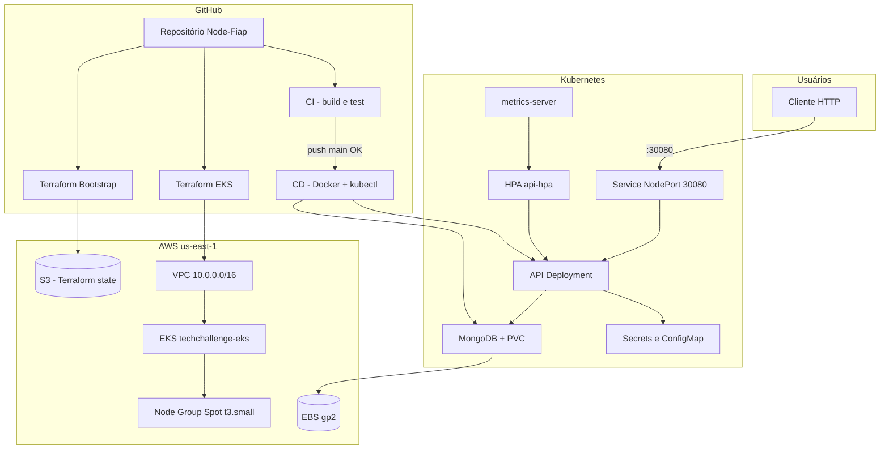

# Arquitetura da Solução

Visão de alto nível da fase Tech Challenge: o que foi construído, por quê, e como as peças se conectam.

## Descrição da solução

O **Node-Fiap** é uma API REST para gestão de oficinas mecânicas, permitindo controlar clientes, veículos, ordens de serviço, estoque e orçamentos.

Nesta fase, a aplicação deixa de rodar apenas em Docker Compose local e passa a ser entregue em um cluster **Amazon EKS**, com infraestrutura declarada em **Terraform** e pipelines **GitHub Actions** separando integração (CI) de entrega (CD).

A escolha por **NodePort** (`30080`) em vez de Ingress/ALB reduz custo em ambiente de laboratório, mantendo a API acessível pelo IP público do node.

## Objetivos desta fase

| Objetivo | Implementação | Benefício |
|---|---|---|
| Containerização | `Dockerfile` + imagem `ruanngodinho/techchallenge:latest` | Mesmo artefato em local e produção |
| Orquestração | Manifests em `k8s/` no EKS | Deploy reproduzível, restart automático |
| Infra como código | `infra/terraform/` | VPC, cluster e IAM versionados |
| CI/CD | `ci.yml` + `cd.yml` | Testes automáticos; deploy só após CI verde |
| Escalabilidade | HPA CPU 60%, 1–4 réplicas | Resposta a carga sem intervenção manual |
| Persistência | MongoDB + PVC EBS (`gp2`) | Dados sobrevivem restart do pod |
| Observabilidade básica | metrics-server | Métricas de CPU para o HPA |

## Diagrama da arquitetura



## Componentes da aplicação

### Camada de software

| Componente | Tecnologia | Responsabilidade |
|---|---|---|
| **API** | Node.js 20, TypeScript, Express | Rotas REST em `/api`, Swagger em `/docs` |
| **Persistência** | MongoDB 8 | Clientes, veículos, OS, estoque, orçamentos |
| **Auth** | JWT | Autenticação stateless |
| **Testes** | Jest | Validação em CI antes de qualquer deploy |
| **Documentação** | Swagger UI | Contrato da API para consumo |

### Camada de entrega

| Componente | Onde | Função |
|---|---|---|
| **Imagem Docker** | Docker Hub | Artefato versionado implantado no cluster |
| **CI** | GitHub Actions | `npm ci`, `npm run build`, `npm test` |
| **CD** | GitHub Actions | Build/push da imagem + `kubectl apply` |
| **Seed** | Job `api-seed-job` | Dados iniciais no Mongo (uma vez no cluster) |

## Infraestrutura provisionada (resumo)

Detalhes em [TERRAFORM.md](TERRAFORM.md).

| Camada | Recursos |
|---|---|
| **Rede** | VPC, 2 subnets públicas (2 AZs), IGW — sem NAT Gateway |
| **Compute** | EKS 1.31, managed node group Spot |
| **Storage** | EBS CSI driver, StorageClass `gp2` |
| **Segurança** | IAM roles (cluster, nodes, IRSA EBS), SGs (NodePort 30080, kubelet) |
| **State** | Bucket S3 com lock nativo (`use_lockfile`) |

## Fluxo de deploy (ponta a ponta)

```text
┌─────────────────────────────────────────────────────────────────┐
│ 1. SETUP (uma vez)                                              │
│    Secrets GitHub → Terraform Bootstrap → bucket S3 + TF_*      │
└─────────────────────────────────────────────────────────────────┘
                              ↓
┌─────────────────────────────────────────────────────────────────┐
│ 2. INFRA (manual)                                               │
│    Terraform apply → EKS + VPC + nodes                          │
└─────────────────────────────────────────────────────────────────┘
                              ↓
┌─────────────────────────────────────────────────────────────────┐
│ 3. APP (automático no push main)                                │
│    CI (build + test) → CD (imagem + k8s) → API em :30080        │
└─────────────────────────────────────────────────────────────────┘
```

Passo a passo operacional: [GITHUB-ACTIONS.md](GITHUB-ACTIONS.md).

## Execução local (resumo)

Ambiente de desenvolvimento sem AWS — ver [README principal](../README.md):

```bash
docker compose up -d --build   # API :3000 + MongoDB
npm test                       # testes unitários
```

## Documentação relacionada

- [Kubernetes](KUBERNETES.md) — deploy no cluster
- [Terraform](TERRAFORM.md) — infra AWS
- [GitHub Actions](GITHUB-ACTIONS.md) — pipelines
- [README da API](../README.md) — uso local da aplicação
