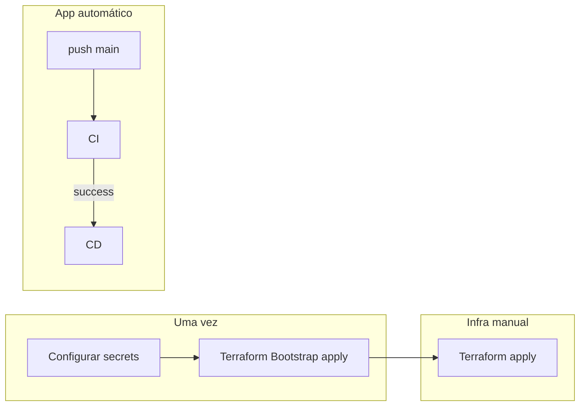

# Passo a passo — GitHub Actions

Guia operacional para subir tudo via GitHub Actions, do zero até a API no ar.

## Mapa dos workflows

| Workflow | Arquivo | Gatilho | O que faz |
|---|---|---|---|
| **CI** | `ci.yml` | PR + push `main` | `npm ci` → build → test |
| **CD** | `cd.yml` | CI OK no push `main` ou manual | Docker push + deploy `k8s/` |
| **Terraform Bootstrap** | `terraform-bootstrap.yml` | Manual | Bucket S3 + secrets auto |
| **Terraform** | `terraform.yml` | Manual | plan / apply / destroy EKS |



---

## Passo 1 — Configurar secrets no GitHub

**Onde:** Repositório → **Settings** → **Secrets and variables** → **Actions**

### Secrets obrigatórios (criar manualmente)

| Secret | Para que serve |
|---|---|
| `AWS_ACCESS_KEY_ID` | Autenticação AWS nos workflows Terraform e CD |
| `AWS_SECRET_ACCESS_KEY` | Par da chave acima |
| `GH_REPO_PAT` | PAT fine-grained com **Secrets** + **Variables** read/write neste repo |
| `DOCKERHUB_USERNAME` | Login para push da imagem no CD |
| `DOCKERHUB_PASSWORD` | Token/senha Docker Hub |

### Secrets criados automaticamente (após Bootstrap)

| Secret / Variable | Origem |
|---|---|
| `TF_STATE_BUCKET` | Output `state_bucket_name` |
| `TF_BACKEND_HCL` | Output `backend_config_snippet` |
| `TF_AWS_REGION` | `us-east-1` |
| `TF_STATE_KEY` | `eks/terraform.tfstate` |

---

## Passo 2 — Terraform Bootstrap

1. **Actions** → **Terraform Bootstrap** → **Run workflow**
2. `action` = **apply**, `confirm` = **yes**
3. Aguardar conclusão

**O que acontece:**

- Cria bucket S3 `techchallenge-tfstate-{ACCOUNT_ID}`
- Persiste bootstrap state em `s3://.../bootstrap/terraform.tfstate`
- Grava secrets/variables no GitHub automaticamente
- Job summary mostra `backend.hcl` (backup manual)

**Verificar:** Settings → Secrets → `TF_STATE_BUCKET` e `TF_BACKEND_HCL` existem.

---

## Passo 3 — Terraform (cluster EKS)

1. **Actions** → **Terraform** → **Run workflow**
2. `action` = **plan** → revisar o plano
3. `action` = **apply**, `confirm` = **yes**

**O que acontece:**

- Lê `TF_BACKEND_HCL` automaticamente
- Copia `terraform.tfvars.example` → `terraform.tfvars`
- Cria VPC, EKS, nodes, addons, IAM
- Job summary mostra comando `aws eks update-kubeconfig`

**Duração típica:** 10–15 minutos.

---

## Passo 4 — CI (automático)

A cada **push** ou **PR** em `main`:

```text
build (npm ci + tsc) → test (jest)
```

| Evento | Comportamento |
|---|---|
| Pull Request | Só valida — **não deploya** |
| Push em `main` | Se CI passar, dispara o CD automaticamente |

---

## Passo 5 — CD (deploy Kubernetes)

### Automático

```text
push main → CI success → CD inicia
```

### Manual

1. **Actions** → **CD** → **Run workflow**
2. `confirm` = **yes**
3. Exige último CI em `main` com status **success**

**O que o CD faz (em ordem):**

1. Build + push `ruanngodinho/techchallenge:latest`
2. `aws eks update-kubeconfig`
3. Deploy metrics-server
4. Deploy secrets e config (`k8s/secrets/`)
5. Deploy MongoDB (StorageClass `gp2` só se não existir)
6. Deploy API, Service, HPA
7. Seed job (só na primeira vez)
8. `rollout restart` da API
9. Job summary com `kubectl get pods -A`

Detalhes dos manifests: [KUBERNETES.md](KUBERNETES.md).

---

## Ordem completa (checklist)

```text
☐ 1. Criar secrets: AWS_ACCESS_KEY_ID, AWS_SECRET_ACCESS_KEY, GH_REPO_PAT, DOCKERHUB_*
☐ 2. Terraform Bootstrap → apply, confirm=yes
☐ 3. Verificar TF_STATE_BUCKET e TF_BACKEND_HCL em Settings → Secrets
☐ 4. Terraform → plan, depois apply, confirm=yes
☐ 5. Push código em main → CI verde → CD deploya
☐ 6. Acessar http://<NODE_IP>:30080/docs
```

---

## Troubleshooting nos workflows

| Erro | Solução |
|---|---|
| PAT 404 em `secrets/public-key` | PAT sem permissão Secrets write ou repo não selecionado |
| `terraform.tfvars.*.example` not found | Garantir `terraform.tfvars.example` commitado no repo |
| `terraform fmt` falha | Workflow atualizado: fmt roda antes do copy de tfvars |
| Secret conflict no CD | Manifests sem `resourceVersion`/`uid`; re-run CD |
| StorageClass gp2 forbidden | Normal em re-deploy — CD ignora se já existir |
| CD manual bloqueado | Rodar CI em `main` com sucesso primeiro |
| Bootstrap sem GH_REPO_PAT | Copiar bucket e backend.hcl do job summary manualmente |

---

## Documentação relacionada

- [Arquitetura](ARQUITETURA.md)
- [Kubernetes](KUBERNETES.md)
- [Terraform](TERRAFORM.md)
- [`infra/terraform/README.md`](../infra/terraform/README.md)
