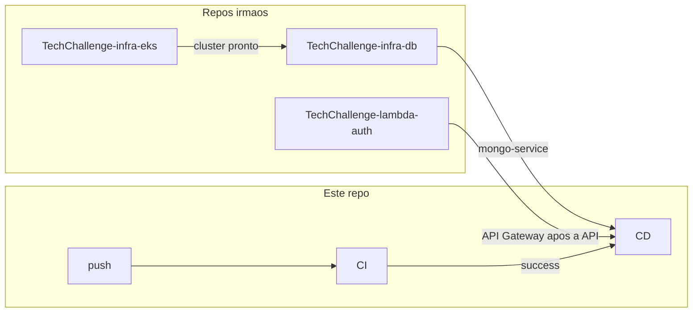

# Passo a passo — GitHub Actions

Nesta branch este repositório só entrega a **API no EKS**. Infra EKS, Lambda e Atlas têm pipelines nos repos irmãos ([REPOS.md](REPOS.md)).

## Mapa dos workflows (este repo)

| Workflow | Arquivo | Gatilho | O que faz |
|---|---|---|---|
| **CI** | `ci.yml` | PR + push `main` / `develop` / `release` | `npm ci` → build → test |
| **CD** | `cd.yml` | CI OK em `main` (prod) ou `release` (homolog), ou manual | Docker push + deploy `k8s/` |

---

## Secrets neste repositório (app / CD)

| Secret | Para que serve |
|---|---|
| `AWS_ACCESS_KEY_ID` | `aws eks update-kubeconfig` no CD |
| `AWS_SECRET_ACCESS_KEY` | Par da chave acima |
| `DOCKERHUB_USERNAME` | Push da imagem |
| `DOCKERHUB_PASSWORD` | Token Docker Hub |
| `GATEWAY_TRUST_SECRET` | Patch do Secret K8s (`X-Gateway-Trust`) — o mesmo valor do repo Lambda |

Variables: `TF_AWS_REGION` (default `us-east-1`), `TF_CLUSTER_NAME` (default `techchallenge-eks`).

Terraform e JWT_SECRET ficam no [TechChallenge-infra-eks](https://github.com/RuannGodinho/TechChallenge-infra-eks) e no [TechChallenge-lambda-auth](https://github.com/RuannGodinho/TechChallenge-lambda-auth).

---

## Deploy da API

1. Cluster EKS existente (monorepo `main` ou, após cutover, apply no repo EKS).
2. `release` é a branch de homologação: CI + CD automático com imagem `:homolog`. `main` é produção (`:latest`). Deploy manual: `workflow_dispatch` com `confirm=yes`.
3. O CD aplica metrics-server, secrets, Mongo in-cluster, API, HPA e seed.

Passo a passo de Kubernetes: [KUBERNETES.md](KUBERNETES.md).
