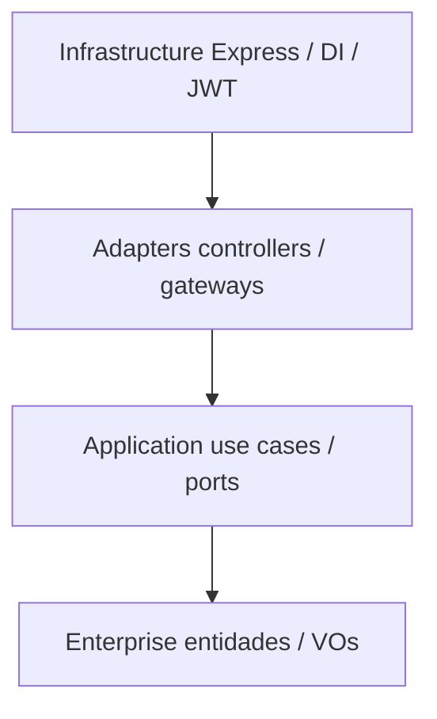

# RFC – Clean Architecture nas camadas da API

| Campo | Valor |
|---|---|
| **Número** | 004 |
| **Data** | 21/08/2026 |
| **Autor** | Ruann Correa Godinho |
| **Status** | Encerrada – Aprovada |
| **ADR** | [ADR-004](../adrs/004-clean-architecture.md) |

## Resumo

Organizar a API em **Clean Architecture**: Enterprise, Application, Adapters e Infrastructure, com dependências apontando para dentro. O domínio da oficina não conhece Express, MongoDB nem AWS.

## Problema

A Node-Fiap já mistura HTTP, JWT, Mongo e SMTP no mesmo processo. Sem fronteiras, regras da OS (status, peças, orçamento) acabam acopladas a `req`/`res`, ao driver do banco e ao provedor de nuvem. Trocar Gateway por auth local, Mongo in-cluster por Atlas, ou Express por outro framework vira reescrita.

O Tech Challenge pede evolução (EKS, Lambda, Atlas) sem reescrever o negócio. A equipe precisa de um lugar único para a regra e de portas para o que muda.

## Proposta técnica

Quatro camadas, pastas correspondentes:

| Camada | Pasta | Responsabilidade |
|---|---|---|
| Enterprise | `src/enterprise` | Entidades (`OrdemServico`, `Cliente`, `Veiculo`) e value objects (`StatusOS`, `Documento`) |
| Application | `src/application` | Casos de uso, DTOs e ports (interfaces) |
| Adapters | `src/Adapters` | Controllers, presenters, gateways Mongo, Nodemailer, JWT |
| Infrastructure | `src/infrastructure` | Express, DI (`di-container.ts`), middlewares, bootstrap |

Regra: um caso de uso fala com **ports**; o gateway Mongo e o adapter SMTP implementam essas ports. O `AUTH_MODE` só aparece na infrastructure — o `CriarOrdemServicoUseCase` não sabe se o JWT veio da Lambda ou do Express.

## Impacto esperado

**Ganhos**

- Testes de caso de uso sem subir HTTP nem Mongo real (`mongodb-memory-server` só nos gateways).
- Cutover Atlas, modo `gateway` e SMTP não alteram entidades.
- Onboarding: o “porquê” da OS está em `enterprise` + `application`, não espalhado em rotas.

**Riscos e restrições**

- Mais arquivos e indirection (controller → use case → port → gateway) do que um MVC curto.
- Disciplina: vazar `ObjectId` ou `Request` para o domínio quebra a proposta.
- Pasta `Adapters` com A maiúsculo é convenção deste repo; misturar com `infrastructure` gera dúvida de onde colocar um middleware.

## Alternativas consideradas

| Alternativa | Por que foi descartada |
|---|---|
| **MVC clássico** (rota + service + model Mongoose) | Entrega rápida, mas o model vira o domínio e o AWS/JWT vazam para o service. Difícil cumprir “domínio isolado”. |
| **Hexagonal pura** (só ports/adapters, sem camadas nomeadas) | Equivalente na prática. Clean Architecture é o vocabulário do curso e mapeia 1:1 nas pastas. |
| **Vertical slices** (uma pasta por feature) | Bom para times grandes. Aqui o núcleo é a OS; fatias prematuras duplicariam VOs e o DI. |

## Pontos em aberto

- Padronizar o nome da pasta `Adapters` vs. `adapters`.
- Critério para novos adapters (ex.: pagamento, WhatsApp) — sempre port na Application, nunca chamada direta no use case.
